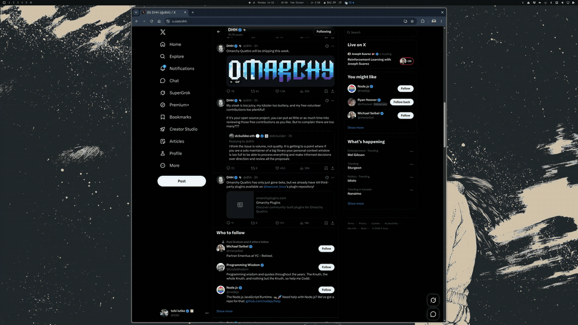

# Omarchy Capture Editor 1.0

A native Wayland screenshot and annotation overlay designed for Omarchy and Hyprland.
It captures the focused monitor before mapping an exclusive layer-shell surface, so the
editor never appears in its own screenshot. The editor retains annotations as movable,
resizable vector layers and preserves the monitor's native pixels on scaled displays.

[](assets/capture-editor.mp4)

## Features

- Freeform region, window, and full-monitor capture modes.
- Clean window-surface capture through Wayland image-copy protocols, with a screen-crop
  fallback when the compositor does not expose the requested surface.
- Select/move/resize layers, mouse-wheel scaling, and eight external recropping handles.
- Arrows, straight lines, smoothed freehand strokes, rectangles, numbered markers, and
  editable Neucha text.
- Per-layer preset or custom colors, undo, OCR-region capture, mesh-gradient backdrops,
  and rendered drop shadows.
- PNG clipboard output through `wl-copy` and timestamped files under
  `~/Pictures/Screenshots` by default.
- Correct native-pixel export on fractional or integer-scaled monitors.

## Platform scope

The supported target is **Wayland + Hyprland**, with Omarchy as the primary integration.
The renderer, layer surface, clipboard, and clean-window capture use Wayland protocols,
but monitor/window discovery currently calls `hyprctl` and the frozen-frame handoff uses
`hyprpicker`. Another Wayland compositor could support the application after supplying
an equivalent discovery/freeze backend; generic Wayland support is not claimed by 1.0.

Runtime commands used by the application:

- `hyprctl` and `hyprpicker`
- `grim`
- `wl-copy`
- `tesseract`
- `omarchy-notification-send` when available; notification failure does not invalidate a
  completed capture

## Install on Omarchy

Clone the repository and run the Omarchy installer:

```bash
git clone https://github.com/tobi/omarchy-capture-editor.git
cd omarchy-capture-editor
./install-omarchy
```

The installer uses Omarchy's package helper for missing dependencies, builds in
`~/.cache/omarchy-capture-editor`, and installs under `~/.local`. It does not modify
Hyprland configuration.

### Hyprland binding

Paste this into a Lua config loaded after `require("default.hypr.omarchy")`:

```lua
hl.unbind("PRINT")
hl.unbind("F12")
hl.unbind("ALT + SHIFT + 4")

o.bind("PRINT", "Screenshot", "omarchy-capture-editor")
o.bind("F12", "Screenshot", "omarchy-capture-editor")
o.bind("ALT + SHIFT + 4", "Screenshot", "omarchy-capture-editor")

hl.layer_rule({
  match = { namespace = "^omarchy-capture-editor$" },
  no_anim = true,
  animation = "none",
})
```

Apply and verify:

```bash
hyprctl reload
hyprctl configerrors
hyprctl binds -j | jq -c \
  '[.[] | select(.description == "Screenshot") | {modmask,key,description}]'
```

`omarchy plugin add` is intentionally not used. Omarchy plugins are Quickshell QML
extensions; they do not install native executables or system packages.

Set `OMARCHY_CAPTURE_PREFIX` before running `install-omarchy` to use a prefix other than
`~/.local`.

### Manual Arch Linux build

Install the complete build/runtime dependency set:

```bash
sudo pacman -S --needed \
  base-devel cmake ninja pkgconf qt6-base layer-shell-qt \
  wayland wayland-protocols hyprland grim hyprpicker wl-clipboard \
  tesseract tesseract-data-eng
```

Build and install:

```bash
cmake -S . -B build -G Ninja \
  -DCMAKE_BUILD_TYPE=Release \
  -DCMAKE_INSTALL_PREFIX="$HOME/.local"
cmake --build build --parallel
cmake --install build
```

The install step places:

- `~/.local/bin/omarchy-capture-editor`
- `~/.local/share/applications/omarchy-capture-editor.desktop`
- `~/.local/share/licenses/omarchy-capture-editor/Neucha-OFL.txt`

Ensure `~/.local/bin` is on `PATH`, then verify the installed CLI:

```bash
omarchy-capture-editor --version
omarchy-capture-editor --help
```

## CLI capture modes

Running without arguments opens freeform region selection:

```bash
omarchy-capture-editor
```

Explicit starting modes:

```bash
omarchy-capture-editor --capture-region
omarchy-capture-editor --capture-window
omarchy-capture-editor --capture-fullscreen
```

Compatibility positional names are also accepted:

```bash
omarchy-capture-editor region
omarchy-capture-editor windows
omarchy-capture-editor fullscreen
omarchy-capture-editor smart       # maps to region selection
```

These options choose what is initially selected; the editor still controls whether the
result is copied, saved, or both.

Environment overrides:

```bash
OMARCHY_SCREENSHOT_DIR="$HOME/Pictures/Captures" omarchy-capture-editor
OMARCHY_OCR_LANGS="eng+deu" omarchy-capture-editor
```

Install the corresponding Tesseract language data before adding a language to
`OMARCHY_OCR_LANGS`.

## Controls

### Capture selection

| Input | Action |
|---|---|
| Drag | Select a region |
| `Space` | Toggle region/window selection |
| `SUPER + Arrow` | Move among windows in window mode |
| `Enter` | Capture the highlighted window |
| `Ctrl+A` | Select the full focused monitor |
| `Esc`, `Esc` | Dismiss |

### Annotation editor

| Input | Action |
|---|---|
| `V` | Select/move/resize layers; wheel scales the selected layer |
| `A` | Arrow |
| `L` | Straight line |
| `F` | Freehand stroke |
| `C` | Numbered marker |
| `R` | Rectangle |
| `T` | Neucha text |
| `O` | Drag an OCR region and copy recognized text |
| `B` | Cycle backdrop |
| `1`–`6` | Set annotation color |
| Wheel | Scale selected layer or change active tool size |
| Double-click text | Reopen text editing |
| `Delete` | Delete selected layer |
| `Ctrl+Z` | Undo |
| `Ctrl+C` | Copy PNG only |
| `Ctrl+S` | Save PNG only |
| `Enter` | Copy and save |
| `Esc` | Return to Select; press again to close |

Creation tools return to Select after one placement. In Select mode, the eight blue/white
handles outside the image recrop its corners or edges.

## Development and verification

```bash
cmake -S . -B build -G Ninja -DCMAKE_BUILD_TYPE=Release
cmake --build build --parallel
QT_QPA_PLATFORM=offscreen \
  ./build/omarchy-capture-editor-smoke /tmp/omarchy-capture-editor-smoke
```

The smoke executable exercises region/window/fullscreen startup modes, capture selection,
annotation tools, vector movement and scaling, text editing, OCR, native-DPI output, and
external crop handles.

`.github/workflows/build-linux.yml` performs the same release build and interaction smoke
in an Arch Linux container, stages the CMake installation, and uploads a versioned Linux
artifact. A `v*` tag also attaches that artifact to the corresponding GitHub release.

## Acknowledgements

The capture and annotation workflow is inspired by three excellent screenshot tools:

- [Shottr](https://shottr.cc/) — fast region/window capture, OCR, and polished backdrops.
- [Satty](https://github.com/Satty-org/Satty) — a focused, Wayland-native annotation workflow.
- [Flameshot](https://github.com/flameshot-org/flameshot) — selection-first capture and an
  approachable annotation toolbar.

Thanks to their authors and contributors for establishing the interaction patterns that made
this project possible. Omarchy Capture Editor is an independent implementation and is not
affiliated with those projects.

## Project history

This standalone repository was extracted with `git filter-repo` from the original Omarchy
system-customization repository. The former `capture-editor/` directory was promoted to
the repository root while retaining its relevant commit history.

The bundled Neucha font is distributed under the SIL Open Font License; its license is in
`assets/OFL.txt` and is installed with the application.
